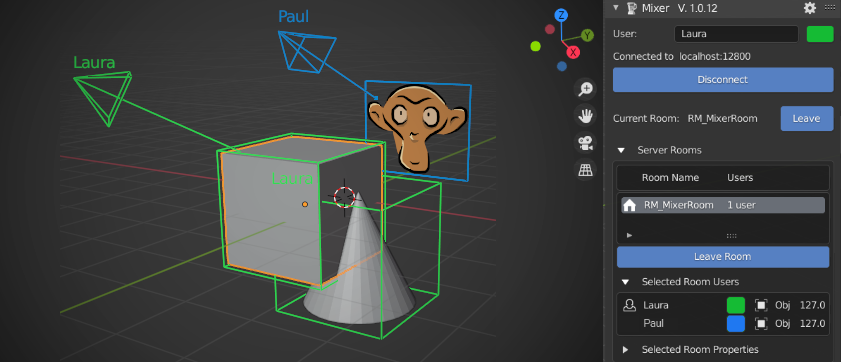

# Mixer

Mixer is a Blender addon for real time collaboration in Blender. It allows multiple Blender users to work on the same scene at the same time and is developed by the R&D department of Ubisoft Animation Studio.

**Disclaimer**: Although designed to be used in a production context it is still an experimental tool.
In spite of all our efforts to make it reliable, it may in some circumstances corrupt your Blender scenes data.
Be aware that neither Ubisoft nor Ubisoft employees can be taken as responsible in such cases. Use it at your own risks.

**This said, we will do our best to improve Mixer thanks to your feedback in order to provide a memorable creative collaborative experience.
Have fun !**

## Features

Refer to the online documentation for details about current [features and limitations](https://ubisoft-mixer.readthedocs.io/en/latest/getting-started/features.html).

## Documentation and Usage

Documentation is available at the web site https://ubisoft-mixer.readthedocs.io/ to :

- [download and install](https://ubisoft-mixer.readthedocs.io/en/latest/getting-started/install.html),
- [test](https://ubisoft-mixer.readthedocs.io/en/latest/getting-started/first-steps.html) locally,
- then [get connected](https://ubisoft-mixer.readthedocs.io/en/latest/collaborate/get-connected.html) and [work together](https://ubisoft-mixer.readthedocs.io/en/latest/collaborate/work-together.html)

## Updates

Updates are announced in the [mixer-addon Blender Chat](https://blender.chat/channel/mixer-addon) channel.

## Support

The active support repository is on the [Mixer Github repository](https://github.com/ubisoft/mixer) which is part of the [Ubisoft open source](https://github.com/ubisoft) projects group.

## Community

The online documentation lists the [YouTube videos](https://ubisoft-mixer.readthedocs.io/en/latest/community/on_youtube.html) posted by community members.

## Feedback and contribution

Post your feedback and discuss your ideas with us on the [Mixer Blender chat](https://blender.chat/channel/mixer-addon).

You can also get involved into the development of Mixer, discover how by reading these [contribution guidelines](doc/README.md).

## License and copyright

The original code is Copyright (C) 2020 Ubisoft.

All code of the `mixer` package is under the GPLv3 license except code of the `mixer.broadcaster` sub-package, which is under the MIT license.

